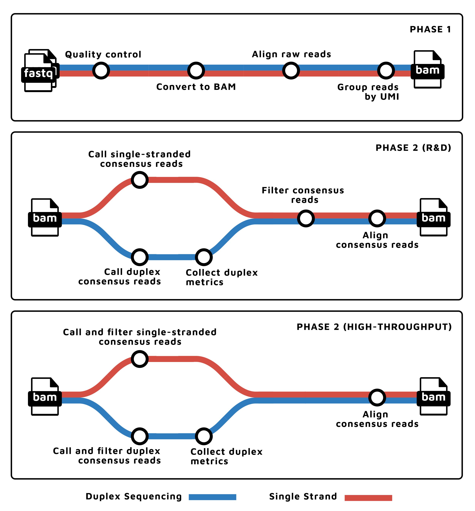

<h1>
  <picture>
    <source media="(prefers-color-scheme: dark)" srcset="docs/images/nf-core-fastquorum_logo_dark.png">
    
  </picture>
</h1>

[](https://github.com/nf-core/fastquorum/actions/workflows/ci.yml)
[](https://github.com/nf-core/fastquorum/actions/workflows/linting.yml)[](https://nf-co.re/fastquorum/results)[](https://doi.org/10.5281/zenodo.11267672)
[](https://www.nf-test.com)
[](https://www.nextflow.io/)
[](https://docs.conda.io/en/latest/)
[](https://www.docker.com/)
[](https://sylabs.io/docs/)
[](https://tower.nf/launch?pipeline=https://github.com/nf-core/fastquorum)

[](https://nfcore.slack.com/channels/fastquorum)[](https://twitter.com/nf_core)[](https://mstdn.science/@nf_core)[](https://www.youtube.com/c/nf-core)

## Introduction

**nf-core/fastquorum** is a bioinformatics pipeline that implements the pipeline implements the [fgbio Best Practices FASTQ to Consensus Pipeline][fgbio-best-practices-link] to produce consensus reads using unique molecular indexes/barcodes (UMIs).
`nf-core/fastquorum` can produce consensus reads from single or multi UMI reads, and even [Duplex Sequencing][duplex-seq-link] reads.

The pipeline is built using [Nextflow](https://www.nextflow.io), a workflow tool to run tasks across multiple compute infrastructures in a very portable manner. It uses Docker/Singularity containers making installation trivial and results highly reproducible. The [Nextflow DSL2](https://www.nextflow.io/docs/latest/dsl2.html) implementation of this pipeline uses one container per process which makes it much easier to maintain and update software dependencies. Where possible, these processes have been submitted to and installed from [nf-core/modules](https://github.com/nf-core/modules) in order to make them available to all nf-core pipelines, and to everyone within the Nextflow community!

On release, automated continuous integration tests run the pipeline on a full-sized dataset on the AWS cloud infrastructure. This ensures that the pipeline runs on AWS, has sensible resource allocation defaults set to run on real-world datasets, and permits the persistent storage of results to benchmark between pipeline releases and other analysis sources. The results obtained from the full-sized test can be viewed on the [nf-core website](https://nf-co.re/fastquorum/results).

<p align="center"></p>

1. Read QC ([`FastQC`](https://www.bioinformatics.babraham.ac.uk/projects/fastqc/))
2. Fastq to BAM, extracting UMIs ([`fgbio FastqToBam`](http://fulcrumgenomics.github.io/fgbio/tools/latest/FastqToBam.html))
3. Align ([`bwa mem`](https://github.com/lh3/bwa)), reformat ([`fgbio ZipperBam`](http://fulcrumgenomics.github.io/fgbio/tools/latest/ZipperBam.html)), and template-coordinate sort ([`samtools sort`](http://www.htslib.org/doc/samtools.html))
4. Group reads by UMI ([`fgbio GroupReadsByUmi`](http://fulcrumgenomics.github.io/fgbio/tools/latest/GroupReadsByUmi.html))
5. Call consensus reads
   1. For [Duplex-Sequencing][duplex-seq-link] data
      1. Call duplex consensus reads ([`fgbio CallDuplexConsensusReads`](http://fulcrumgenomics.github.io/fgbio/tools/latest/CallDuplexConsensusReads.html))
      2. Collect duplex sequencing specific metrics ([`fgbio CollectDuplexSeqMetrics`](http://fulcrumgenomics.github.io/fgbio/tools/latest/CollectDuplexSeqMetrics.html))
   2. For non-Duplex-Sequencing data:
      1. Call molecular consensus reads ([`fgbio CallMolecularConsensusReads`](http://fulcrumgenomics.github.io/fgbio/tools/latest/CallMolecularConsensusReads.html))
6. Align ([`bwa mem`](https://github.com/lh3/bwa))
7. Filter consensus reads ([`fgbio FilterConsensusReads`](http://fulcrumgenomics.github.io/fgbio/tools/latest/FilterConsensusReads.html))
8. Present QC ([`MultiQC`](http://multiqc.info/))

## Verified Vendors, Kits, and Assays

> [!WARNING]
> The following Vendors, Kits, and Assays are provided for informational purposes only.
> _No warranty for the accuracy or completeness of the information or parameters is implied._

| Verified | Assay                                                     | Company                     | Strand | Randomness | UMI Location     | Read Structure  | URL                                                                                                                                                                                 |
| -------- | --------------------------------------------------------- | --------------------------- | ------ | ---------- | ---------------- | --------------- | ----------------------------------------------------------------------------------------------------------------------------------------------------------------------------------- |
| No       | SureSelect XT HS                                          | Agilent Technologies        | Single | Random     |                  |                 | [link](https://www.agilent.com/en/product/next-generation-sequencing/ngs-library-prep-target-enrichment-reagents/dna-seq-reagents/sureselectxt-hs-reagent-kits-4252208)             |
| No       | SureSelect XT HS2 (MBC)                                   | Agilent Technologies        | Dual   | Random     |                  |                 | [link](https://www.agilent.com/en/product/next-generation-sequencing/ngs-library-prep-target-enrichment-reagents/dna-seq-reagents/sureselect-xt-hs2-dna-reagent-kit-4252207)        |
| No       | TruSight Oncology (TSO)                                   | Illumina                    | Dual   | Nonrandom  |                  |                 | [link](https://www.illumina.com/products/by-type/clinical-research-products/trusight-oncology-umi.html)                                                                             |
| No       | xGen dual index UMI Adapters                              | Integrated DNA Technologies | Single | Random     | index1 (i7)      |                 | [link](https://www.idtdna.com/pages/products/next-generation-sequencing/workflow/xgen-ngs-library-preparation/ngs-adapters-indexing-primers/adapters-indexing-primers-for-illumina) |
| No       | xGen Prism (xGen cfDNA & FFPE DNA Library Prep MC v2 Kit) | Integrated DNA Technologies | Dual   | Nonrandom  |                  |                 | [link](https://www.idtdna.com/pages/products/next-generation-sequencing/workflow/xgen-ngs-library-preparation/dna-library-preparation/cfdna-ffpe-prep-kit)                          |
| No       | NEBNext                                                   | New England Biosciences     | Single | Random     | index1 (i7)      |                 | [link](https://www.neb.com/en-us/products/e7874nebnext-multiplex-oligos-for-illumina-unique-dual-index-umi-adaptors-dna-set-2)                                                      |
| No       | AML MRD                                                   | TwinStrand Biosciences      | Dual   | Random     |                  |                 | [link](https://twinstrandbio.com/aml-assay/)                                                                                                                                        |
| No       | Mutagenesis                                               | TwinStrand Biosciences      | Dual   | Random     |                  |                 | [link](https://twinstrandbio.com/mutagenesis-assay/)                                                                                                                                |
| No       | UMI Adapter System                                        | Twist Biosciences           | Dual   | Random     | Inline (R1 & R2) | `5M2S+T 5M2S+T` | [link](https://www.twistbioscience.com/products/ngs/library-preparation/twist-umi-adapter-system)                                                                                   |

Column Definitions:

- Assay: the name of the assay or kit
- Company: the name of the company or vendor providing the assay or kit
- Strand: Dual if both strands of a double-stranded source molecule are sequences (e.g. Duplex Sequencing), Single otherwise
- Randomness: if the unique molecular identifiers (UMIs) are fully random (degenerate) or are synthesized from a fixed set
- UMI Location: the location of UMIs within the reads.
- Read Structure: the [`read_structure`][read-structure-link] describes how the bases in a sequencing run should be allocated into logical reads, including the unique molecular index(es)
- URL: link(s) to vendor documentation or further information

To become "Verified" by `nf-core/fastquorum`, please open an issue and provide the maintainers with an example dataset that can be shared publicly.
The dataset or a subset will be added to [nf-core/test-datasets](https://github.com/nf-core/test-datasets/tree/fastquorum).
Please reach out to maintainers if additional support is needed to prepare or select such data.

## Usage

> [!NOTE]
> If you are new to Nextflow and nf-core, please refer to [this page](https://nf-co.re/docs/usage/installation) on how to set-up Nextflow. Make sure to [test your setup](https://nf-co.re/docs/usage/introduction#how-to-run-a-pipeline) with `-profile test` before running the workflow on actual data.

First, prepare a samplesheet with your input data that looks as follows:

`samplesheet.csv`:

```csv
sample,fastq_1,fastq_2,read_structure
CONTROL_REP1,AEG588A1_S1_L002_R1_001.fastq.gz,AEG588A1_S1_L002_R2_001.fastq.gz,5M2S+T 5M2S+T
```

Each row represents a fastq file (single-end) or a pair of fastq files (paired end).
The `sample` column provides a unique identifier for the given sample, while the `read_structure` describes how the bases in a sequencing run should be allocated into logical reads, including the unique molecular index(es).
(Please see the [fgbio documentation](https://github.com/fulcrumgenomics/fgbio/wiki/Read-Structures) for detailed information on read structure syntax and formatting.)

Now, you can run the pipeline using:

```bash
nextflow run nf-core/fastquorum \
   -profile <docker/singularity/.../institute> \
   --input samplesheet.csv \
   --genome GRCh38 \
   --outdir <OUTDIR>
```

> [!WARNING]
> Please provide pipeline parameters via the CLI or Nextflow `-params-file` option. Custom config files including those provided by the `-c` Nextflow option can be used to provide any configuration _**except for parameters**_;
> see [docs](https://nf-co.re/usage/configuration#custom-configuration-files).

Two modes of running this pipeline are supported:

1. Research and Development (R&D): use `--mode rd` or `params.mode=rd`. This mode is desirable to be able to branch off from the pipeline and test e.g. multiple consensus calling or filtering parameters
2. High Throughput (HT): use `--mode ht` or `params.mode=ht`. This mode is intended for high throughput production environments where performance and throughput take precedence over flexibility

For more details and further functionality, please refer to the [usage documentation](https://nf-co.re/fastquorum/usage) and the [parameter documentation](https://nf-co.re/fastquorum/parameters).

See also:

1. The [fgbio Best Practise FASTQ -> Consensus Pipeline][fgbio-best-practices-link]
2. [Read structures](https://github.com/fulcrumgenomics/fgbio/wiki/Read-Structures) as required in the input sample sheet.

## Pipeline output

To see the results of an example test run with a full size dataset refer to the [results](https://nf-co.re/fastquorum/results) tab on the nf-core website pipeline page.
For more details about the output files and reports, please refer to the
[output documentation](https://nf-co.re/fastquorum/output).

## Credits

nf-core/fastquorum was originally written and is primarily maintained by Nils Homer.

We thank the following people for their extensive assistance in the development of this pipeline:

- [Nils Homer](https://github.com/nh13)

## Acknowledgements

We thank [Fulcrum Genomics](https://www.fulcrumgenomics.com/) for their extensive assistance in the development of this pipeline.

<p align="left">
<a href="https://fulcrumgenomics.com">

</a>
</p>

## Contributions and Support

If you would like to contribute to this pipeline, please see the [contributing guidelines](.github/CONTRIBUTING.md).

For further information or help, don't hesitate to get in touch on the [Slack `#fastquorum` channel](https://nfcore.slack.com/channels/fastquorum) (you can join with [this invite](https://nf-co.re/join/slack)).

## Citations

If you use nf-core/fastquorum for your analysis, please cite [](https://doi.org/10.5281/zenodo.11267672) for this pipeline and [](https://zenodo.org/doi/10.5281/zenodo.10456900) for [`fgbio`](https://github.com/fulcrumgenomics/fgbio).

An extensive list of references for the tools used by the pipeline can be found in the [`CITATIONS.md`](CITATIONS.md) file.

You can cite the `nf-core` publication as follows:

> **The nf-core framework for community-curated bioinformatics pipelines.**
>
> Philip Ewels, Alexander Peltzer, Sven Fillinger, Harshil Patel, Johannes Alneberg, Andreas Wilm, Maxime Ulysse Garcia, Paolo Di Tommaso & Sven Nahnsen.
>
> _Nat Biotechnol._ 2020 Feb 13. doi: [10.1038/s41587-020-0439-x](https://dx.doi.org/10.1038/s41587-020-0439-x).

[fgbio-best-practices-link]: https://github.com/fulcrumgenomics/fgbio/blob/main/docs/best-practice-consensus-pipeline.md
[duplex-seq-link]: https://en.wikipedia.org/wiki/Duplex_sequencing
